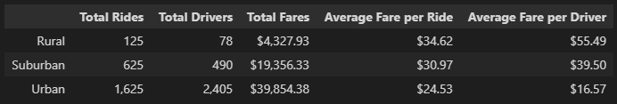
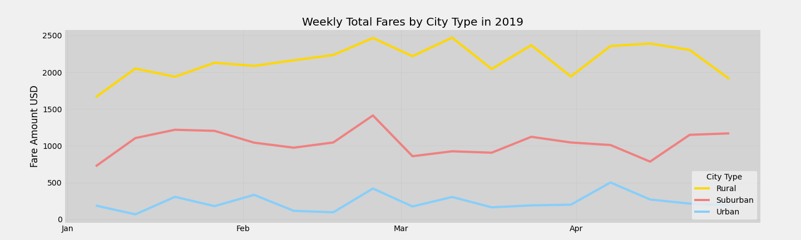

# PyBer Analysis
## Overview
This is an exploratory analysis of ridership, driver coverage, and fare revenue of a mock ride share company. The purpose is to determine any trends between the three types of cities. The types of cities are:

    1. Urban
    2. Suburban
    3. Rural

## Results

### Statistical Summary by City Type

#### Greatest Fare Generator

Given that urban centers are high density and the general trend that urbanites don't own cars, urban city types lead in total number of rides, drivers, and fare revenue. 

Urban fare revenue is twice as much as suburban, which is second in fare revenue.

#### Most Costly City Type

Urban also has the lowest average fare per ride. This could be explained by the small size but high density of urban population centers. Riders only need a short trip to get from one side of downtown to the other.

The large size and low density of rural communities leads to higher average fare prices and drivers that are 3.5 times more costly than drivers in urban areas.

### Weekly Fare Performance

#### Greatest Fare Generator
The weekly fare revenue by city type again shows the dominance of urban in fare revenue over the other city types. Urban averages about $2,100 per week over the second best city type, suburban, which generates about $1,000 per week, or about double the revenue of suburban.

#### Trend

At least during the first quarter of 2019, the fare revenue remains releatively constant. This leads to the following question:

   Is revenue not growing because the market has been saturated, not enough drivers, or customers are not aware of the service? Or a combination of all three factors?

Further data is needed to answer the question.

## Summary
The recommendations below focus on maintaing current revenue streams with the possibility of growing new revenue streams.

1. Continue to support urban drivers given urban city types are the primary revenue driver for Pyber.
2. Rural service is too costly for both driver and customer and provides little in revenue.
3. Immediate focus needs to be on why revenue has remained flat and is not growing over time with special focus on the following possible factors:

    * Market saturation (Pyber or competition)
    * Driver support (Supply meeting demand for service) 
    * Customer awareness (More advertising?)
